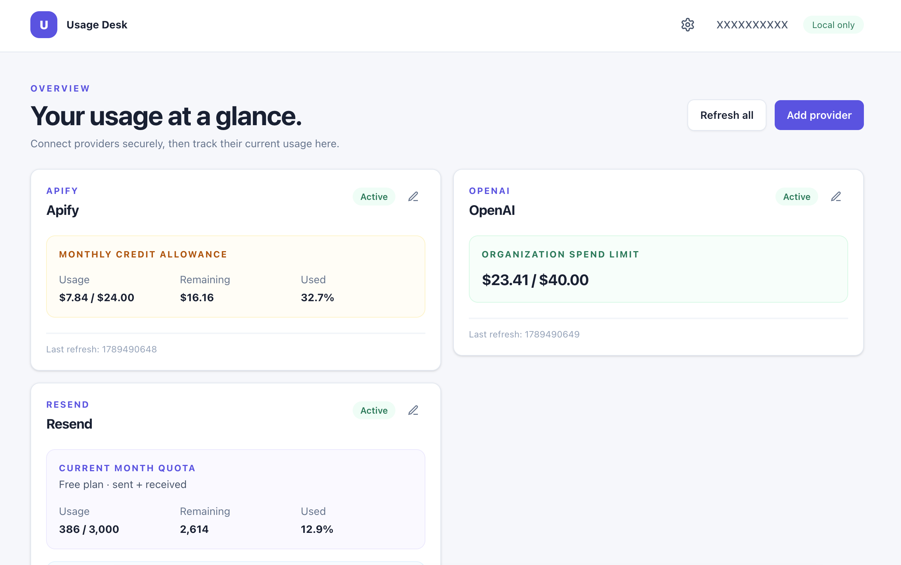

# Rust Usage Dashboard

[](https://github.com/sz-tamas/rust-usage-dash/actions/workflows/ci.yml)
[](LICENSE)
[](https://www.rust-lang.org/)
[](https://tailwindcss.com/)
[](https://htmx.org/)
[](https://github.com/askama-rs/askama)

A secure localhost-only dashboard for provider usage. It persists provider metadata and normalized usage snapshots in SQLite; provider credential values are fetched only when a refresh runs and are never stored in the database or sent to the browser.



## Prerequisites

- [mise](https://mise.jdx.dev/)
- Google Cloud CLI authenticated with Application Default Credentials: `gcloud auth application-default login`
- IAM access restricted to the specific Secret Manager secrets used by this dashboard

## Start

```bash
mise run install
mise run start
```

`mise run start` opens `http://127.0.0.1:5050`, as configured in `mise.toml`. Direct `cargo run` defaults to `http://127.0.0.1:3000`. Set `USAGE_DASH_PORT` to choose another local port.

The database defaults to `data/usage-dashboard.sqlite3`; override that non-secret path with `USAGE_DASH_DATABASE_PATH` if desired.

`mise run install` downloads the Tailwind standalone binary to `.tools/`. No `package.json` or `node_modules` is used. `mise run css:build` recompiles `static/css/output.css` from `static/css/input.css`.

For Rust development with automatic rebuilds and server restarts, run:

```bash
mise run dev
```

## Adding a provider

Enter a reference in this exact form:

```text
projects/PROJECT_ID/secrets/SECRET_ID/versions/VERSION
```

You can also enter just the Secret Manager secret name (for example, `OPENAI_ADMIN_KEY`); the dashboard expands it to the active Google project and `versions/latest`. Enter a secret reference, never the provider API key itself. The dashboard resolves that reference only while refreshing the provider.

### OpenAI

Use an OpenAI Admin API key. A refresh requests organization costs and spend alerts concurrently, then shows the current calendar-month spend against the largest monthly spend-alert threshold. If the spend-alert request fails after costs are collected, the cost snapshot is retained and marked as partial.

### Apify

Enter the plan's included monthly credit allowance in USD when creating or editing the provider (for example, `19` for a $19 allowance). The dashboard uses `totalUsageCreditsUsdAfterVolumeDiscount` and calculates:

- Usage: discounted monthly spend / allowance
- Remaining: allowance − discounted monthly spend
- Used: discounted monthly spend / allowance × 100

### Resend

Enter the plan label plus monthly and daily email quotas. The dashboard collects sent and received email totals and displays quota usage, remaining allowance, and the percentage used.

Neon and Upstash may be configured in the UI but do not yet have collectors.

## Security boundary

- The server binds only to `127.0.0.1`; `USAGE_DASH_PORT` in `mise.toml` selects its port (currently: `5050`).
- Provider API keys are not read from `.env`, configuration, or process environment variables. SQLite contains secret *references* and sanitized metrics only, never provider credential values.
- The browser receives provider metadata, refresh status, and normalized metrics only. It never receives a provider API key or a Secret Manager payload.
- Application Default Credentials (ADC) are intentionally stored locally by `gcloud` (normally in `~/.config/gcloud/application_default_credentials.json`). This is the Google authentication needed to read Secret Manager; it is not a provider API key.
- Every provider refresh obtains a fresh ADC token as needed, reads the configured Secret Manager version, and then makes the provider request. The dashboard does not cache provider API keys: a Secret Manager or provider-access failure fails that refresh rather than falling back to an older credential.
- The resolved provider key is held as Rust `secrecy::SecretString` and exposed only at the provider's authorization call. `SecretString` zeroizes its backing value when dropped; decoded intermediate buffers use `zeroize` as well. No key is written to a file, database, browser response, or log. Network/TLS libraries necessarily hold transient request-header buffers while sending the request.
- Logs contain only safe diagnostic metadata, such as an HTTP status or key-shape flags. They never contain a provider key, authorization header, Secret Manager payload, access token, or provider response body.

### Authorization and credential disclaimer

This is a local tool run by you, for accounts and secrets you are authorized to use. No dashboard operator, maintainer, hosted service, or browser user is sent your credential value, and the application does not display, persist, or log it. The credential is retrieved locally from the Secret Manager reference you choose and is sent only as a transient HTTPS authorization header to the provider you configured. You are responsible for granting Google IAM access only to the intended secrets and for using provider credentials with the permissions you intend.

### Local threat model

The dashboard protects credentials from its SQLite database, logs, browser responses, and network listeners outside the local machine. It does not protect against a person or malicious process that already controls the machine or the Google account/ADC identity used to run it. Use a dedicated local account where appropriate, keep the machine secure, and grant that identity access only to the specific Secret Manager secrets required.

Before using production credentials, run `mise run check` and review IAM grants and provider-specific response handling.
